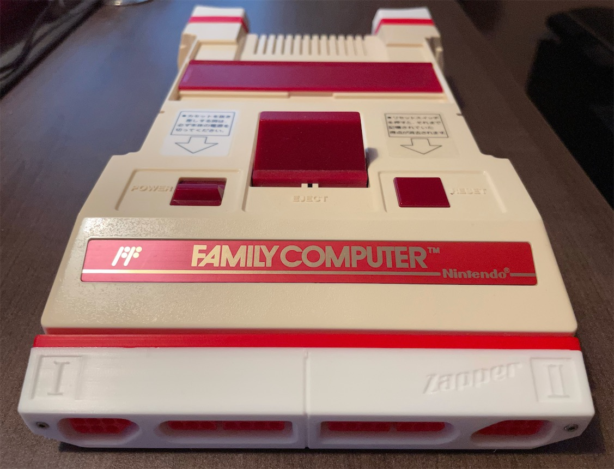
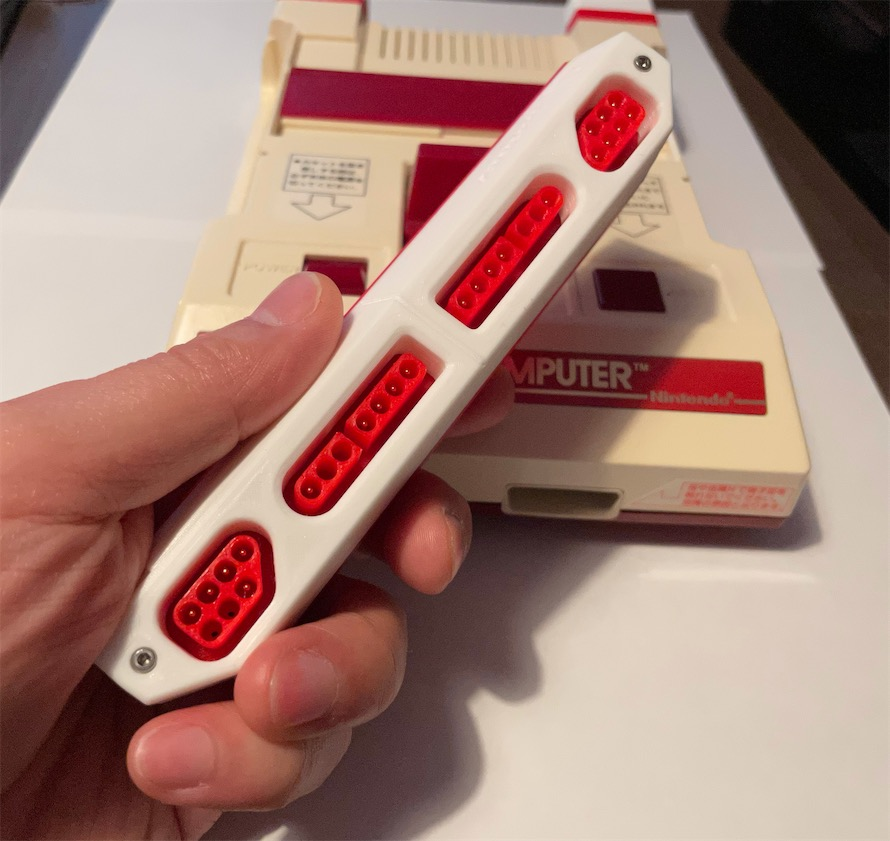
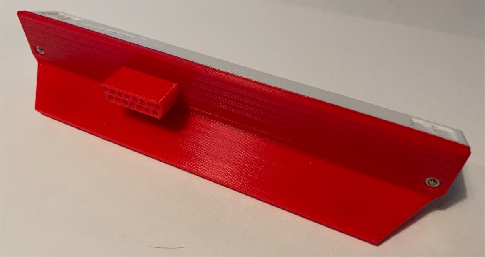
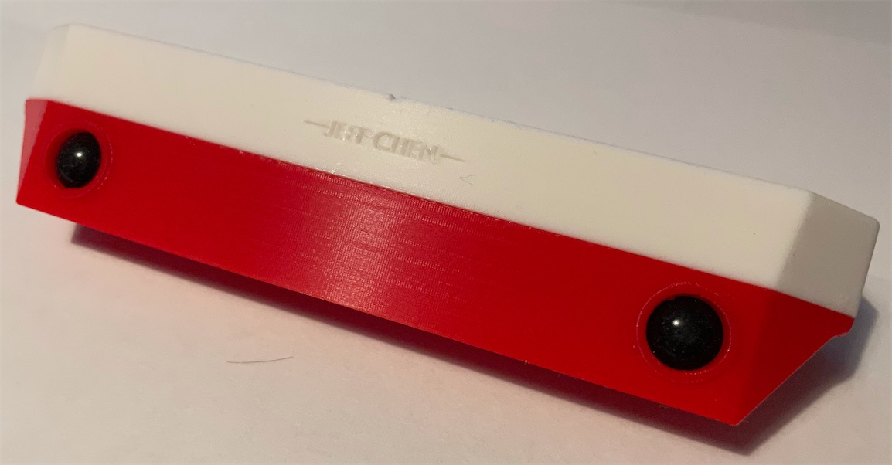
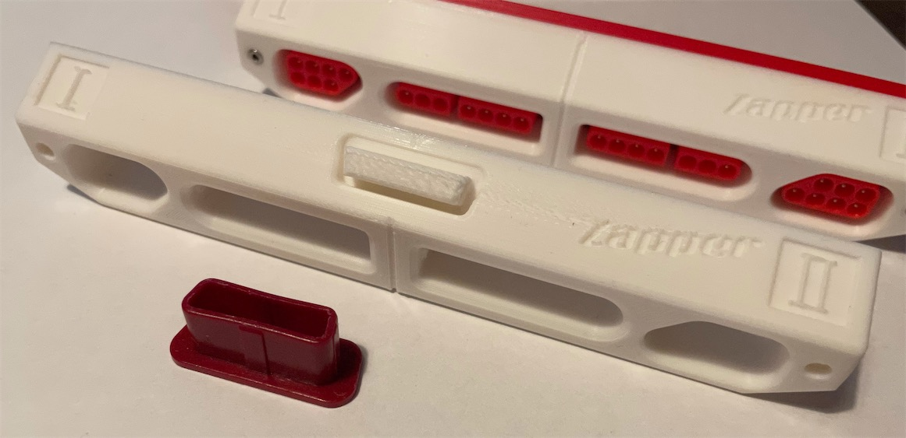
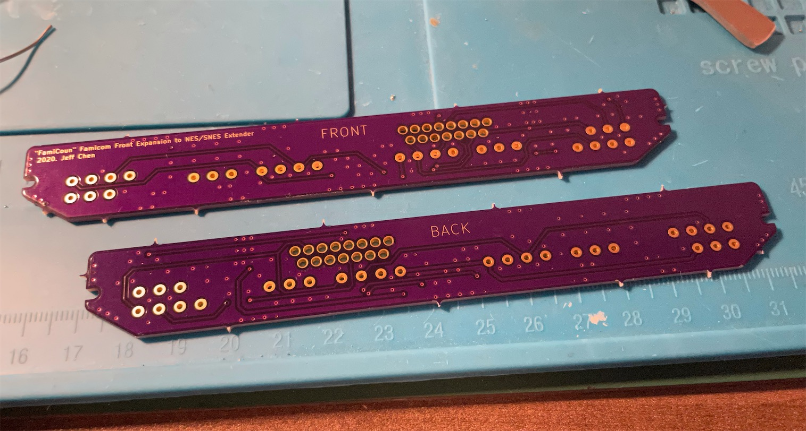
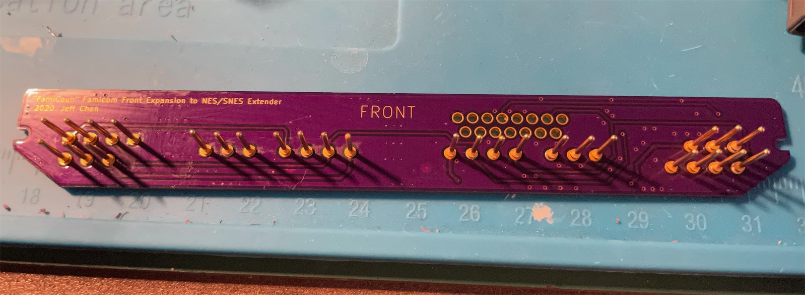
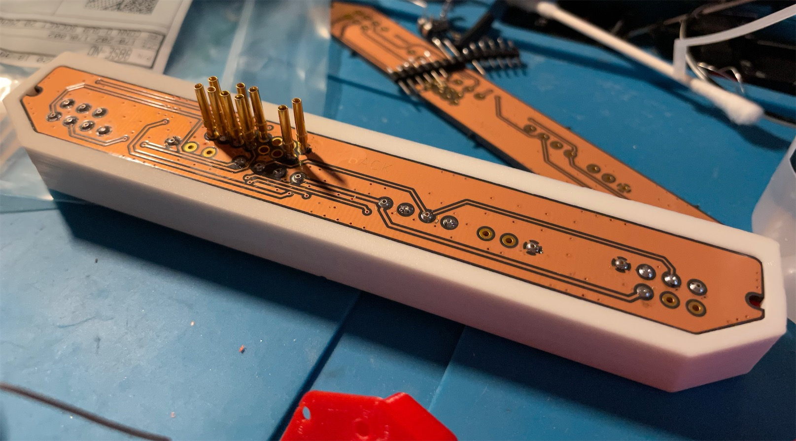

# "FamiCoun" Famicom Front Expansion NES/SNES Controller Adapter

Here is my design of an expansion to connect NES and SNES controller to the front port of a Nintendo Famicom.

It makes the Famicom look like a Countach in the front. Hence the name of this project.

The player 2 NES port supports the Zapper, as shown on the shell.

Note when you use a SNES controler, Y is B and B is A.

--------

## PARTS

The pins used in the project can be purchased from Digikey.

Pins on the front
- Quantity: 22 or 28
- Part No.: ED1183-ND
- Name: CONN PC PIN CIRC 0.040DIA GOLD by Mill-Max Manufacturing Corp.

Pins on the back:
- Quantity: 9 or 15
- Part No.: 88SE-ND
- Name:CONN D-SUB SOCKET 20-26AWG CRIMP

PCB
- https://oshpark.com/shared_projects/L9FUXWiv

[2x] M2x16mm Hex Screw & Nut
- https://www.amazon.com/gp/product/B014OO5KQG

3D Printed Shell

--------

## 3D Printing

Print the front jacket, the plugs and the back. The orientation should be pretty self-explanatory when you put them into the slicer.

Support is required for the front jacket.

A different version of the front jacket is provided with a holder design for the cover you take off from the Famicom, so you don't end up losing the original cover easily (however if you already lost yours, you can print a new one. I uploaded a design a while back.)

--------

## Assembly

Soldering is pretty straightforward. You can use the printed parts to help holding the pins in place and then solder. Just don't let the iron stay on the PCB for too long or you might melt the printed parts.

Note you don't have to populate all the pins, but it makes it look better.

Screw and nut used is **Hex M2 16mm** (full length 17.8mm). This can be purchased from Amazon as a kit.

--------

## Misc

Thingiverse Design：[https://www.thingiverse.com/thing:4671897](https://www.thingiverse.com/thing:4671897)

--------

Special Thanks

Chris Kempson
- [http://chriskempson.com/posts/nes-controller-to-famicom-adapter/](http://chriskempson.com/posts/nes-controller-to-famicom-adapter/)

NesDev Wiki
- [https://wiki.nesdev.com](https://wiki.nesdev.com/)

Mike Chi, Creator of the Famous RetroTink)
- [https://www.retrotink.com](https://www.retrotink.com/)
