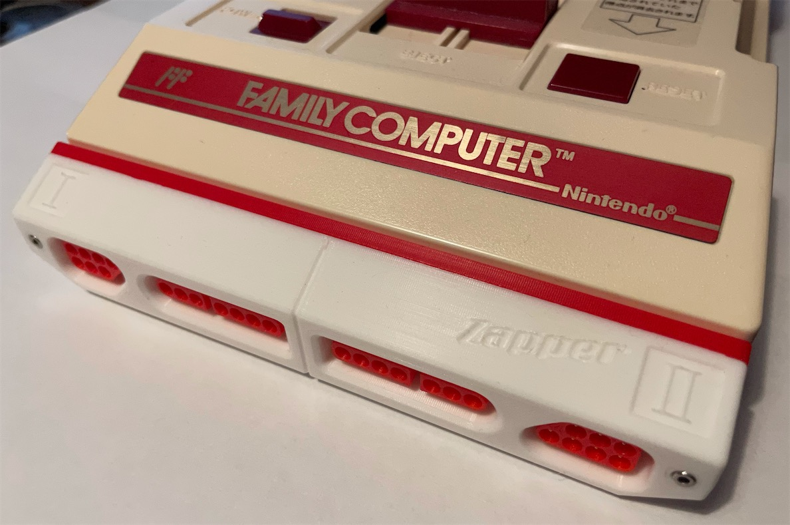

# "FamiCoun" Famicom Front Expansion NES/SNES Controller Adapter

 

 

Here is my design of an expansion to connect NES and SNES controller to the front port of a Nintendo Famicom.

It makes the Famicom look like a Countach in the front. Hence the name of this project.

The player 2 NES port supports the Zapper, as shown on the shell.

Note when you use a SNES controler, Y is B and B is A.

--------

## PARTS

Pins
- [PCB](https://oshpark.com/shared_projects/L9FUXWiv)

- [22x or 28x] Front Pins - Terminal Pins, Male, Machined - [Link](https://github.com/jeffqchen/JeffParts/blob/main/Connectors/Terminal%20Pins/Machined%20Male/info.md)

- [9x] Back Pins - Terminal Pins, Female, Machined - [Link](https://github.com/jeffqchen/JeffParts/blob/main/Connectors/Terminal%20Pins/Machined%20Female/info.md)

- [2x] M2x16mm Hex Screw & Nut - [Link](https://github.com/jeffqchen/JeffParts/blob/main/Parts/M2%20M3%20Hex%20Screw%20%26%20Nut/info.md)

- 3D Printed Shell

--------

## 3D Printing

Print the front jacket, the plugs and the back. The orientation should be pretty self-explanatory when you put them into the slicer.

Support is required for the front jacket.

After the print is done, make sure you enlarge the holes for the NES plugs with a 9/64 drill bit, so plugs can go in properly. I suggest doing it manually since it's easy to overshoot and destroy the smaller holes at the bottom. All this is because if I made the holes any bigger, the slicers would refuse to generate a smooth wall and make the hole not round.

A different version of the front jacket is provided with a holder design for the cover you take off from the Famicom, so you don't end up losing the original cover easily (however if you already lost yours, you can print a new one. I uploaded a design a while back.)

--------

## Assembly

Soldering is pretty straightforward. You can use the printed parts to help holding the pins in place and then solder. Just don't let the iron stay on the PCB for too long or you might melt the printed parts.

Note you don't have to populate all the pins, but it makes it look better.

Put the plugs part over the front side through the pins, then seat the assembly into the front jacket piece.

Finally, close it up with the back piece and secure with two sets of M2x16mm screws and nuts.

--------

## Misc

Thingiverse Design
- [https://www.thingiverse.com/thing:4671897](https://www.thingiverse.com/thing:4671897)

--------

Special Thanks

Chris Kempson
- [http://chriskempson.com/posts/nes-controller-to-famicom-adapter/](http://chriskempson.com/posts/nes-controller-to-famicom-adapter/)

NesDev Wiki
- [https://wiki.nesdev.com](https://wiki.nesdev.com/)

Mike Chi, Creator of the Famous RetroTink)
- [https://www.retrotink.com](https://www.retrotink.com/)

--------

Shield: [![CC BY-SA 4.0][cc-by-sa-shield]][cc-by-sa]

This work is licensed under a
[Creative Commons Attribution-ShareAlike 4.0 International License][cc-by-sa].

[![CC BY-SA 4.0][cc-by-sa-image]][cc-by-sa]

[cc-by-sa]: http://creativecommons.org/licenses/by-sa/4.0/
[cc-by-sa-image]: https://licensebuttons.net/l/by-sa/4.0/88x31.png
[cc-by-sa-shield]: https://img.shields.io/badge/License-CC%20BY--SA%204.0-lightgrey.svg
